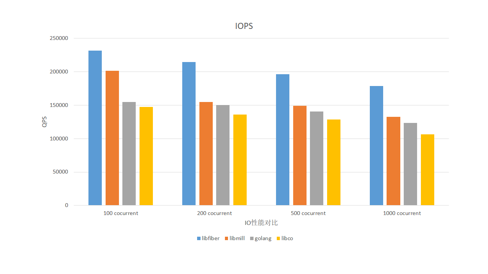

# 高性能网络协程库，支持 Linux/BSD/Mac/Windows

## 概述
本协程库来自于 [acl 工程](#https://github.com/acl-dev/acl) 协程模块。目前支持的操作系统有：Linux，FreeBSD，MacOS 和 Windows，支持的事件类型有：select，poll，epoll，kqueue，iocp 及 Windows GUI 窗口消息。通过 libfiber 网络协程库，用户可以非常容易地写出高性能、高可靠的网络通信服务。因为使用了同步顺序编程的思维方式，相对于异步模式（无论是 reactor 模型还是 proactor 模型），编写网络应用更加简单。  
libfiber 不仅支持常见的 IO 事件引擎，而且支持 Win32 GUI 界面消息引擎，这样当你使用 MFC，wtl 或其它 GUI 界面库编写界面网络应用时，也会变得异常简单，这的确是件令人兴奋的事。

## 支持的事件引擎有哪些？
以下为 libfiber 所支持的事件引擎：

Event|Linux|BSD|Mac|Windows
-----|----|------|---|---
<b>select</b>|yes|yes|yes|yes
<b>poll</b>|yes|yes|yes|yes
<b>epoll</b>|yes|no|no|no
<b>kqueue</b>|no|yes|yes|no
<b>iocp</b>|no|no|no|yes
<b>Win GUI message</b>|no|no|no|yes

## 示例

### 基于协程的网络服务器

```C
// fiber_server.c

#include <stdio.h>
#include <stdlib.h>
#include <assert.h>
#include "fiber/lib_fiber.h"
#include "patch.h" // in the samples path

static size_t      __stack_size  = 128000;
static const char *__listen_ip   = "127.0.0.1";
static int         __listen_port = 9001;

static void fiber_client(ACL_FIBER *fb, void *ctx)
{
	SOCKET *pfd = (SOCKET *) ctx;
	char buf[8192];

	while (1) {
#if defined(_WIN32) || defined(_WIN64)
		int ret = acl_fiber_recv(*pfd, buf, sizeof(buf), 0);
#else
		int ret = recv(*pfd, buf, sizeof(buf), 0);
#endif
		if (ret == 0) {
			break;
		} else if (ret < 0) {
			if (acl_fiber_last_error() == FIBER_EINTR) {
				continue;
			}
			break;
		}
#if defined(_WIN32) || defined(_WIN64)
		if (acl_fiber_send(*pfd, buf, ret, 0) < 0) {
#else
		if (send(*pfd, buf, ret, 0) < 0) {
#endif			
			break;
		}
	}

	socket_close(*pfd);
	free(pfd);
}

static void fiber_accept(ACL_FIBER *fb, void *ctx)
{
	const char *addr = (const char *) ctx;
	SOCKET lfd = socket_listen(__listen_ip, __listen_port);

	assert(lfd >= 0);

	for (;;) {
		SOCKET *pfd, cfd = socket_accept(lfd);
		if (cfd == INVALID_SOCKET) {
			printf("accept error %s\r\n", acl_fiber_last_serror());
			break;
		}
		pfd = (SOCKET *) malloc(sizeof(SOCKET));
		*pfd = cfd;

		// create and start one fiber to handle the client socket IO
		acl_fiber_create(fiber_client, pfd, __stack_size);
	}

	socket_close(lfd);
	exit (0);
}

// FIBER_EVENT_KERNEL represents the event type on
// Linux(epoll), BSD(kqueue), Mac(kqueue), Windows(iocp)
// FIBER_EVENT_POLL: poll on Linux/BSD/Mac/Windows
// FIBER_EVENT_SELECT: select on Linux/BSD/Mac/Windows
// FIBER_EVENT_WMSG: Win GUI message on Windows
// acl_fiber_create/acl_fiber_schedule_with are in `lib_fiber.h`.
// socket_listen/socket_accept/socket_close are in patch.c of the samples path.

int main(void)
{
	int event_mode = FIBER_EVENT_KERNEL;

#if defined(_WIN32) || defined(_WIN64)
	socket_init();
#endif

	// create one fiber to accept connections
	acl_fiber_create(fiber_accept, NULL, __stack_size);

	// start the fiber schedule process
	acl_fiber_schedule_with(event_mode);

#if defined(_WIN32) || defined(_WIN64)
	socket_end();
#endif

	return 0;
}
```

### 基于协程的客户端程序

```C
// fiber_client.c

#include <stdio.h>
#include <stdlib.h>
#include <string.h>
#include <assert.h>
#include "fiber/lib_fiber.h"
#include "patch.h" // in the samples path

static const char *__server_ip   = "127.0.0.1";
static int         __server_port = 9001;

// socket_init/socket_end/socket_connect/socket_close are in patch.c of the samples path

static void fiber_client(ACL_FIBER *fb, void *ctx)
{
	SOCKET cfd = socket_connect(__server_ip, __server_port);
	const char *s = "hello world\r\n";
	char buf[8192];
	int i, ret;

	if (cfd == INVALID_SOCKET) {
		return;
	}

	for (i = 0; i < 1024; i++) {
#if defined(_WIN32) || defined(_WIN64)
		if (acl_fiber_send(cfd, s, strlen(s), 0) <= 0) {
#else
		if (send(cfd, s, strlen(s), 0) <= 0) {
#endif			
			printf("send error %s\r\n", acl_fiber_last_serror());
			break;
		}

#if defined(_WIN32) || defined(_WIN64)
		ret = acl_fiber_recv(cfd, buf, sizeof(buf), 0);
#else
		ret = recv(cfd, buf, sizeof(buf), 0);
#endif		
		if (ret <= 0) {
			break;
		}
	}

#if defined(_WIN32) || defined(_WIN64)
	acl_fiber_close(cfd);
#else
	close(cfd);
#endif
}

int main(void)
{
	int event_mode = FIBER_EVENT_KERNEL;
	size_t stack_size = 128000;

	int i;

#if defined(_WIN32) || defined(_WIN64)
	socket_init();
#endif

	for (i = 0; i < 100; i++) {
		acl_fiber_create(fiber_client, NULL, stack_size);
	}

	acl_fiber_schedule_with(event_mode);

#if defined(_WIN32) || defined(_WIN64)
	socket_end();
#endif

	return 0;
}
```

### 基于协程的 Windows 界面网络程序
在[示例目录](samples/WinEchod) 下为基于协程的 Windows 界面网络程序，程序运行截屏如

该 Windows 界面程序包含`网络服务器`和`网络客户端`两个功能。在运行时，服务模块和客户端模块运行在 Windows 界面线程中，因为协程库使用了 Windows 界面消息泵，所以协程模块可以与界面上元素成为`一体`而不必跨越线程，也不必使用令人烦恼的异步套接字 API。

### 更多例子
在 [示例](https://github.com/libfiber/samples/) 中有一些例子描述了如何使用 libfiber 库提供的 API 进行网络编程；另外，在 [acl工程中](https://github.com/acl-dev/acl/tree/master/lib_fiber/samples)，有更多的示例来描述网络协程编程，当然，这些例子还大量使用了 [acl 库](https://github.com/acl-dev/acl/)中的其它库的 API。

## 编程 libfiber 本协程库
### 在 Unix 平台编译

```
$cd libfiber
$make
$cd samples
$make
```

<b>下面给出了一个例子的 Makefile 内容：</b>

```
fiber_server: fiber_server.c
	gcc -o fiber_server fiber_server.c patch.c -I{path_of_fiber_header} -L{path_of_fiber_lib) -lfiber -ldl -lpthread

fiber_client: fiber_client.c
	gcc -o fiber_client fiber_client.c patch.c -I{path_of_fiber_header} -L{path_of_fiber_lib) -lfiber -ldl -lpthread
```

### 在 Windows 平台编译
目前可以使用 vc2012/vc2013/vc2015 分别打开 [fiber_vc2012.sln](fiber_vc2012.sln) /[fiber_vc2013.sln](fiber_vc2013.sln)/[fiber_vc2015.sln](fiber_vc2015.sln) 编译 libfiber 库。

## 性能测试
下面仅做了简单的 IOPS （网络 IO 性能）的测试，同时和其它协程库做了简单的对比：  
  
其它的网络协程库有：[libmill](https://github.com/sustrik/libmill)，golang 和 [libco](https://github.com/Tencent/libco)。其中，各个库的压测示例：
1. 基于 libmill 和 libco 的压测用例在 [目录](benchmark) 下;
2. 基于 Golang 的压测用例在 [目录](https://github.com/acl-dev/master-go/tree/master/examples/echo)中;
3. 基于 libfiber 的压测用例：[示例](samples/server);
4. 客户端压测程序：https://github.com/acl-dev/acl/tree/master/lib_fiber/samples/client2

## API 列表  

### Base API  
- acl_fiber_create  
- acl_fiber_self  
- acl_fiber_status  
- acl_fiber_kill   
- acl_fiber_killed  
- acl_fiber_signal  
- acl_fiber_yield  
- acl_fiber_ready  
- acl_fiber_switch  
- acl_fiber_schedule_init  
- acl_fiber_schedule  
- acl_fiber_schedule_with  
- acl_fiber_scheduled  
- acl_fiber_schedule_stop  
- acl_fiber_set_specific  
- acl_fiber_get_specific  
- acl_fiber_delay  
- acl_fiber_last_error  
- acl_fiber_last_serror  

### IO API
- acl_fiber_recv  
- acl_fiber_recvfrom  
- acl_fiber_read  
- acl_fiber_readv  
- acl_fiber_recvmsg  
- acl_fiber_write  
- acl_fiber_writev  
- acl_fiber_send  
- acl_fiber_sendto  
- acl_fiber_sendmsg  
- acl_fiber_select  
- acl_fiber_poll  
- acl_fiber_close  

### Net API
- acl_fiber_socket  
- acl_fiber_listen  
- acl_fiber_accept  
- acl_fiber_connect  
- acl_fiber_gethostbyname_r
- acl_fiber_getaddrinfo
- acl_fiber_freeaddrinfo

### Channel API  
- acl_channel_create  
- acl_channel_free  
- acl_channel_send  
- acl_channel_send_nb  
- acl_channel_recv  
- acl_channel_recv_nb  
- acl_channel_sendp  
- acl_channel_recvp  
- acl_channel_sendp_nb  
- acl_channel_recvp_nb  
- acl_channel_sendul  
- acl_channel_recvul  
- acl_channel_sendul_nb  
- acl_channel_recvul_nb  

### Sync API
<b>ACL_FIBER_MUTEX</b>  
- acl_fiber_mutex_create  
- acl_fiber_mutex_free  
- acl_fiber_mutex_lock  
- acl_fiber_mutex_trylock  
- acl_fiber_mutex_unlock  

<b>ACL_FIBER_RWLOCK</b>  
- acl_fiber_rwlock_create  
- acl_fiber_rwlock_free  
- acl_fiber_rwlock_rlock  
- acl_fiber_rwlock_tryrlock  
- acl_fiber_rwlock_wlock  
- acl_fiber_rwlock_trywlock  
- acl_fiber_rwlock_runlock  
- acl_fiber_rwlock_wunlock  

<b>ACL_FIBER_EVENT</b>  
- acl_fiber_event_create  
- acl_fiber_event_free  
- acl_fiber_event_wait  
- acl_fiber_event_trywait  
- acl_fiber_event_notify  

<b>ACL_FIBER_SEM</b>  
- acl_fiber_sem_create  
- acl_fiber_sem_free  
- acl_fiber_sem_wait  
- acl_fiber_sem_post  
- acl_fiber_sem_num

## 关于 API Hook
在 Linux/MacOS/FreeBSD 平台上，很多与 IO 和网络相关的的系统 API 被 hook 了，因此，在编译连接时将 libfiber 加上，这样你的应用程序中仅需使用系统标准 IO API，便可以使你的网络程序自动协程化。下面是一些被 hook 的系统 API 列表：  
- close
- sleep
- read
- readv
- recv
- recvfrom
- recvmsg
- write
- writev
- send
- sendto
- sendmsg
- sendfile64
- socket
- listen
- accept
- connect
- select
- poll
- epoll: epoll_create, epoll_ctl, epoll_wait
- gethostbyname(_r)
- getaddrinfo/freeaddrinfo

## FAQ
（待续，请先参考英文版 FAQ 说明）。。。
